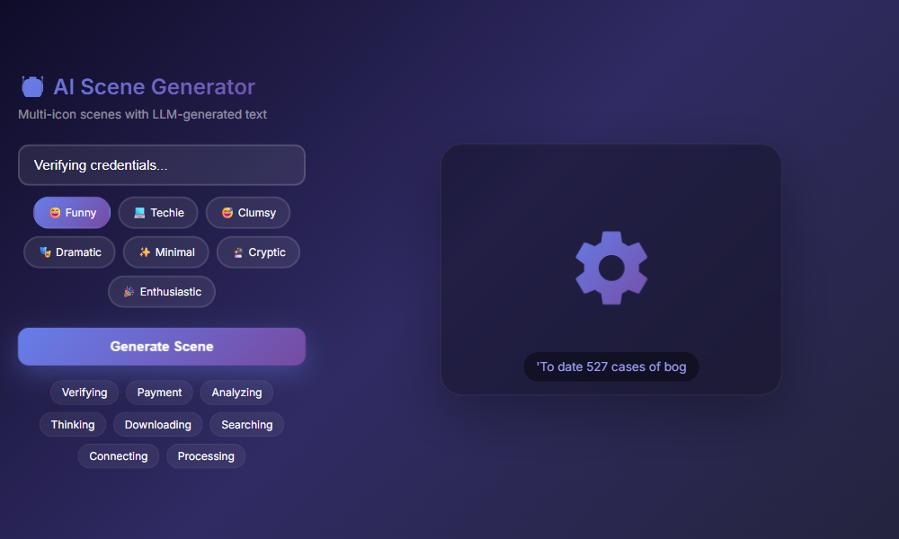
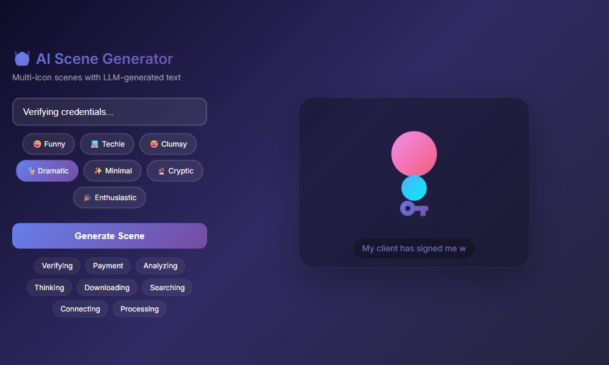

# 🧠 Neural Preloader

> AI-powered loading scenes with personality. Runs entirely in your browser.



Instead of boring spinners, what if loading screens had **mood**?

## ✨ Features

- **7 Mood Personalities** - Funny, Techie, Clumsy, Dramatic, Minimal, Cryptic, Enthusiastic
- **5 Scene Layouts** - single, orbit, flow, stack, scatter
- **LLM-Generated Text** - GPT-2 runs client-side via Transformers.js
- **Toast Notifications** - Visual feedback for every interaction
- **MAX Temperature** - 1.5-2.5 for experimental, varied output
- **1000+ Icons** - Material Icons selected intelligently
- **Zero API Keys** - Everything runs in-browser, no server needed

## 🎬 Demo



Try it live: **[ai-generator.html](https://terseprompts.github.io/neural-preloader/ai-generator.html)**

## 🚀 Quick Start

```bash
git clone https://github.com/tersePrompts/neural-preloader.git
cd neural-preloader
python -m http.server 8080
# Open http://localhost:8080/ai-generator.html
```

## 📦 Use as a Preloader

```html
<link href="https://fonts.googleapis.com/icon?family=Material+Icons" rel="stylesheet">

<script type="module">
  import { init, show, hide } from './dist/index.js';

  // Initialize
  const preloader = await init({
    status: 'Loading...',
    mood: 'techie'
  });

  // Show during loading
  preloader.show('Verifying credentials...', 'dramatic');

  // Hide when done
  preloader.hide();
</script>
```

## 🎭 Mood Gallery

| Mood | Vibe | Example Text |
|------|------|--------------|
| 😄 **Funny** | Witty, playful | "Herding cats", "Bribing the server" |
| 💻 **Techie** | Technical, futuristic | "Allocating memory", "Spinning containers" |
| 😅 **Clumsy** | Self-deprecating | "Tripping over wires", "Dropping packets" |
| 🎭 **Dramatic** | Theatrical, epic | "The suspense builds", "Destiny awaits" |
| ✨ **Minimal** | Clean, simple | "Processing", "Loading", "Working" |
| 🔮 **Cryptic** | Mysterious, vague | "The path unfolds", "Shadows whisper" |
| 🎉 **Enthusiastic** | Excited, energetic | "Let's go!", "Crushing it!" |

## 🎨 Scene Types

```
┌─────────┐  ┌──────────────────┐  ┌─────────────────────┐
│   ●    │  │      ○  ●  ○     │  │    ○ → ● → ○       │
│  spin  │  │     orbit        │  │      flow          │
└─────────┘  └──────────────────┘  └─────────────────────┘

┌─────────┐  ┌──────────────────┐
│    ●    │  │      ○  ○        │
│    ○    │  │    ○   ●   ○     │
│    ○    │  │     scatter      │
│  stack  │  └──────────────────┘
└─────────┘
```

## 🔧 API

```javascript
// Initialize with options
await init({
  container: document.getElementById('preloader'), // optional
  status: 'Loading...',
  mood: 'techie',           // funny, techie, clumsy, dramatic, minimal, cryptic, enthusiastic
  autoGenerate: true
});

// Show scene
show('Processing payment...', 'dramatic');

// Hide scene
hide();

// Change mood
setMood('enthusiastic');
```

## 🧠 How It Works

1. **Transformers.js** runs GPT-2 entirely in the browser
2. **MAX temperature** (1.5-2.5) for experimental output
3. **Mood-based prompts** shape the text generation
4. **Icon categories** provide context-aware selections
5. Falls back gracefully if LLM unavailable

## 📦 Tech Stack

- Vanilla JS (ES6 modules)
- [Transformers.js](https://huggingface.co/docs/transformers.js) (Xenova/gpt2)
- Material Icons (Google)

## 📝 Notes

- First load downloads LLM model (~234MB) - cached after
- Falls back to keyword matching if LLM fails
- This is a fun experiment, not production code

## 📄 License

MIT

---

Made with 🧠 by [tersePrompts](https://github.com/tersePrompts)
